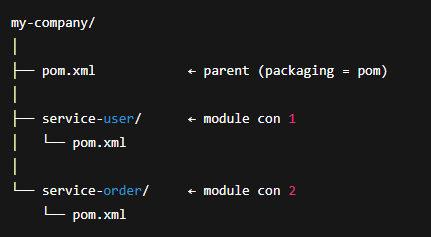

# Tạo project có structure parent-child

Mô tả: project parent (pom) sẽ có các module là các project child (jar)

Mục đích: các module child sẽ kế thừa các dependency của parent, có thể dùng các dependency riêng nếu cần

---

## Các bước tạo project

> 1️⃣ Tạo project cha (packing: pom)

>`mvn archetype:generate -DgroupId=com.company -DartifactId=my-company -DarchetypeArtifactId=maven-archetype-quickstart -DinteractiveMode=false`

> 2️⃣ Tạo các module child (cmd bên trong parent folder)

>`mvn archetype:generate -DgroupId=com.company -DartifactId=service-user -DarchetypeArtifactId=maven-archetype-quickstart -DinteractiveMode=false`

> **⚠️ Chú ý:** Thuộc tính `groupId` và `version` trong các module child có thể không khai báo để đồng bộ với parent