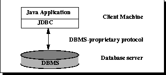
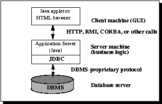

# Tổng quan JDBC

JDBC helps you to write Java applications that manage these three programming activities:

1. Connect to a data source, like a database  
2. Send queries and update statements to the database  
3. Retrieve and process the results received from the database in answer to your query  

Ví dụ:

```java
public void connectToAndQueryDatabase(String username, String password) {

    // Step 1
    Connection con = DriverManager.getConnection(
                         "jdbc:myDriver:myDatabase",
                         username,
                         password);

    // Step 2
    Statement stmt = con.createStatement();
    ResultSet rs = stmt.executeQuery("SELECT a, b, c FROM Table1");

    // Step 3
    while (rs.next()) {
        int x = rs.getInt("a");
        String s = rs.getString("b");
        float f = rs.getFloat("c");
    }
}

```

---

JDBC includes 4 components:

  1. ** JDBC API **
  2. ** JDBC Driver Manager **
  3. ** JDBC Test Suite **
  4. ** JDBC-ODBC Bridge **
  
---
### JDBC Architecture

1. Two-tier Architecture for Data Access



2. Three-tier Architecture for Data Access

